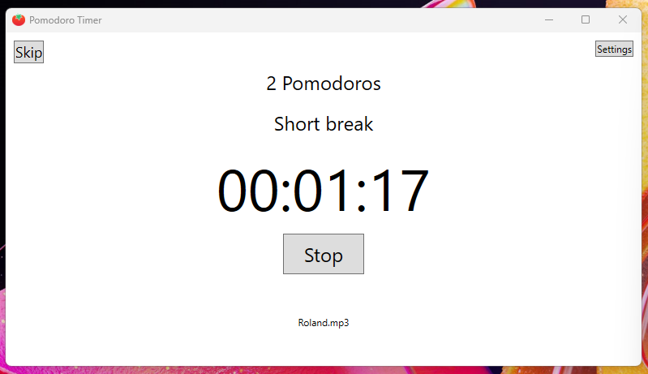
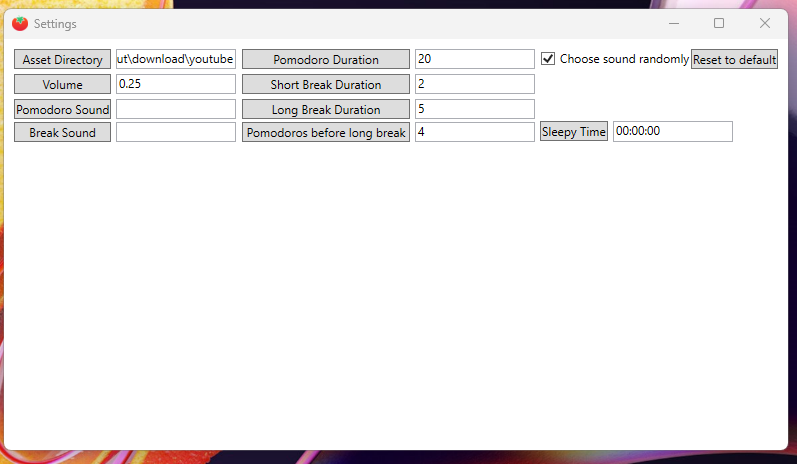

# Pomodoro Timer

A pomodoro timer app using C# and WPF.

## Features

-   Play a song whenever the work period ends and the break period ends
    -   Cycle through random song lists generated from `.wav` and `.mp3` files in a directory and its subdirectories
-   Reminder to nag you to go to sleep (comes with a song)

## Screenshots

Main window

Settings

